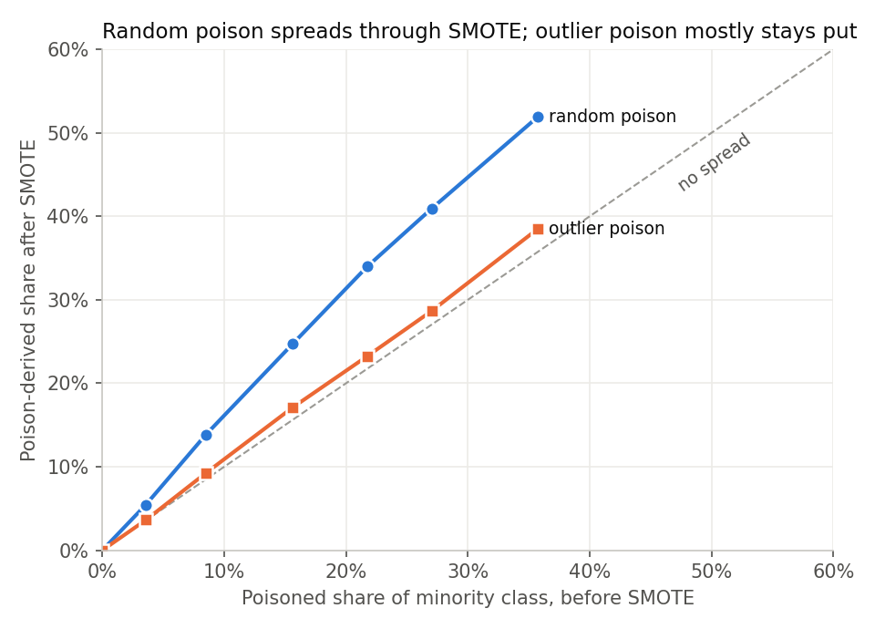
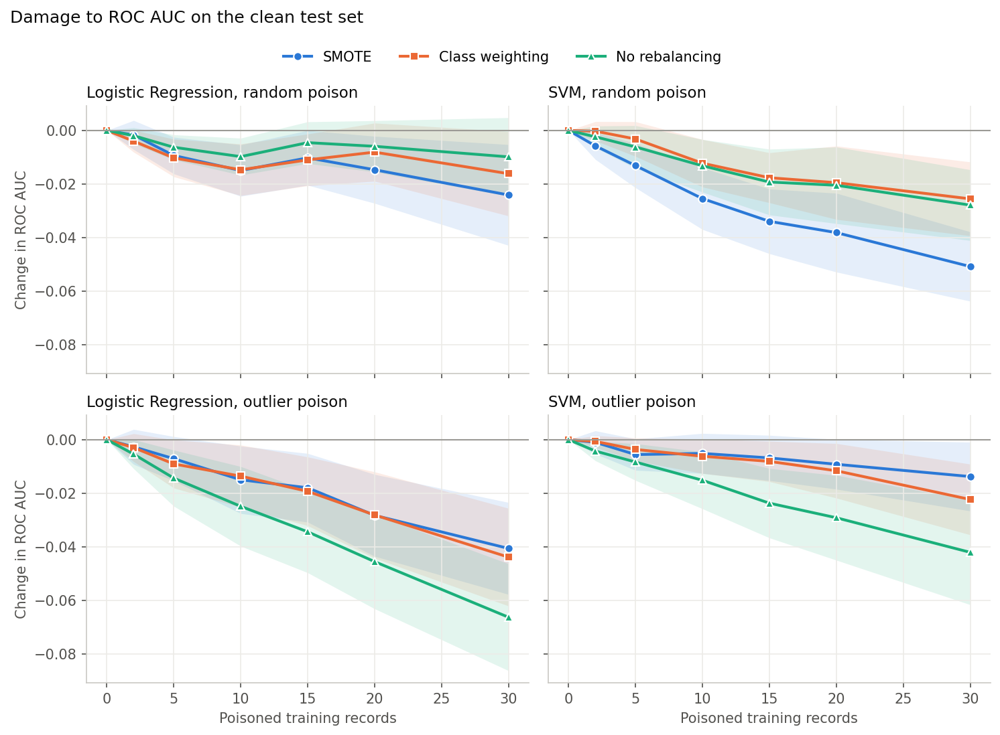

# Does SMOTE amplify data poisoning?

A pilot study of how class rebalancing interacts with **label-flipping poisoning attacks** on imbalanced health data. It uses the Q-CHAT autism screening dataset from my [MSc dissertation](https://github.com/JerryD19/autism-risk-detection-ml).

**Tools:** Python · scikit-learn · imbalanced-learn · NumPy · pandas · Matplotlib

---

## The question

Imbalanced datasets such as screening, fraud and intrusion detection are routinely rebalanced with **SMOTE**, which creates synthetic minority samples by interpolating between a minority point and one of its nearest minority neighbours. Suppose an attacker relabels a few majority-class records as minority. Do those poisoned points get *copied into* the synthetic data, and does that make the attack more damaging?

## Design

| | |
|---|---|
| **Data** | 1,016 toddlers, 67 high risk (6.6%). Features: sex, age, total score and 25 Q-CHAT items (`group` excluded because it leaks the label) |
| **Clean test set** | Split off first (stratified 20%); never poisoned or resampled |
| **Attack** | Relabel *k* low-risk training records as high risk, *k* = 0–30 (up to 3.7% of training data) |
| **Attackers** | *random*: random low-risk records · *outlier*: low-risk records furthest from the high-risk class |
| **Rebalancing** | none · class weighting · SMOTE (5 neighbours, 1:1) |
| **Models** | Logistic regression, RBF SVM |
| **Repeats** | 30 random splits; all damage measured against the unpoisoned run of the same repeat (paired) |

To see where the poison goes, I wrote a **tracked SMOTE** that records both parents of every synthetic sample. It uses the same sampling scheme as `imbalanced-learn` and gives the same cross-validated performance (ROC AUC 0.732 vs 0.729).

## Results

### 1. SMOTE spreads random poison; outlier poison stays put



With 30 randomly flipped records (36% of the real minority class), poisoned points or their synthetic offspring made up **52% of the rebalanced minority class**. Each poisoned record seeded about **12 synthetic samples**. Outlier poison spreads far less (36% → 39%), because records far from the real high-risk children rarely become their neighbours.

### 2. That spread turns into extra damage, but only for some models and attacks



Change in ROC AUC on the clean test set at 30 poisoned records, mean ± 95% CI over 30 repeats:

| Attack | Model | No rebalancing | Class weighting | SMOTE |
|---|---|---|---|---|
| random | Logistic regression | −0.010 ± 0.015 | −0.016 ± 0.016 | −0.024 ± 0.019 |
| random | SVM | −0.028 ± 0.013 | −0.026 ± 0.014 | **−0.051 ± 0.013** |
| outlier | Logistic regression | **−0.066 ± 0.020** | −0.044 ± 0.018 | −0.041 ± 0.017 |
| outlier | SVM | **−0.042 ± 0.020** | −0.022 ± 0.013 | −0.014 ± 0.013 |

- **Random poison + SVM:** SMOTE roughly **doubles** the damage. The paired difference against class weighting is −0.025 ± 0.010 ROC AUC.
- **Random poison + logistic regression:** the same direction, but smaller and borderline (−0.008 ± 0.007).
- **Outlier poison:** the model *without* rebalancing suffers most, and SMOTE is no worse than class weighting.
- **False alarms:** under random poison, both rebalancing methods raise the false-positive rate by up to ~8 percentage points. In screening terms, that means more families referred unnecessarily.

## Takeaway

Oversampling interacts with poisoning in a measurable way, but the effect is **conditional**. Poison that blends into the minority class gets spread by interpolation and does more damage, especially to local models like an RBF SVM. Poison far from the minority class does not. SMOTE is therefore not automatically the weak point, but nobody should assume it is safe either. It needs systematic study, which is the first research question of my PhD proposal on AI model security.

## Limitations and next steps

- One small dataset with weak signal (ROC AUC ≈ 0.77) and ~13 high-risk children per test set, so the effects are noisy even with 30 repeats.
- One attack family (label flipping) and two models.
- **Next:** model the expected poison-derived share mathematically and compare it with the measured curve. Repeat on a larger security dataset (e.g. CIC-IDS2017). Test attackers who deliberately place poison near the minority class. Check whether shifts in SHAP attributions can detect poisoned training batches.

---

## Repository structure

```
├── src/poisoning.py                              # tracked SMOTE, poisoning, experiment runner
├── notebooks/smote_poisoning_experiment.ipynb    # runs the experiment, charts and tables (with outputs)
├── results/results.csv                           # raw results: 2,520 runs
├── images/                                       # figures used in this README
├── data/                                         # place Qchat_Full_Polish_Cleaned.csv here (not included)
└── requirements.txt
```

**To run:** `pip install -r requirements.txt`, add the dataset to `data/`, then run the notebook (about 2 minutes).

**Data:** Q-CHAT dataset from Niedźwiecka, A. and Pisula, E. (2022), *International Journal of Environmental Research and Public Health*, 19(5), 3072. https://doi.org/10.3390/ijerph19053072
